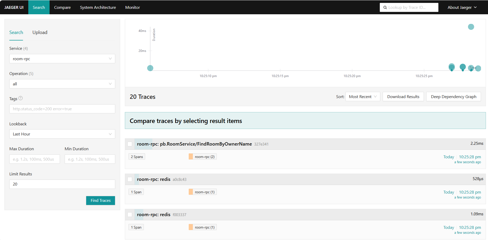

# 简易在线直播平台

---

## 功能介绍

#### 用户部分

用户登录，注册，发送验证码到手机（因为要云服务所以暂未实装）

#### 房间部分

开启，关闭，进入，退出直播间

获取直播间的推流地址和推流码

获取直播间观看人数

#### 直播部分

推流（livego框架）

实时聊天，送礼，抽奖

---

## 技术栈

| 功能    | 实现                 |
| ----- | ------------------ |
| rpc框架 | go-zero            |
| 长连接   | websocekt          |
| 数据库   | mysql              |
| 缓存    | redis              |
| 鉴权    | jwt                |
| 服务与发现 | etcd               |
| 消息队列  | go-queue，channel   |
| 链路追踪  | jaeger             |
| 监控    | prometheus,grafana |
| 推流    | livego             |

#### 关于高并发

###### 进出房间上锁

使用悲观锁防止房间内register和unregister的冲突

###### 消息聚合

将待广播的消息放入内存队列，一定时间后一起广播

可以降低高峰期的qps

###### 消息压缩

使用gzip进行压缩和解压缩，降低消息体积

#### 简单的测试

jaeger
这里以room-rpc为例

prometheus

点击开启直播间后可以获取直播间的推流地址

聊天,视频流与送礼

---

## 待优化的部分

**将IM层和消息层分离**

重构resp的status

完善鉴权

支持直播间封面的上传

支持对直播间tag检索查找

拓展为分布式

尝试部署

---
#### 鸣谢
@Aquamarine

